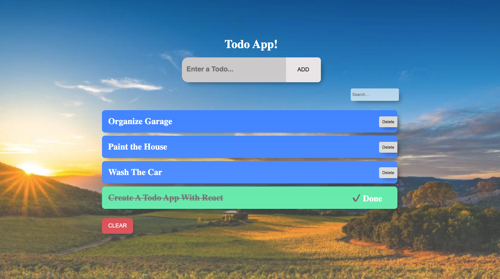

# React-Todo

We're going to practice building a stateful class component with this project. Even though hooks are gaining popularity among react developers, class components are going to be around for a long time. It's imperative that you get use to class components, and feel comfortable working with class components since you'll most likely need to work with them if you are hired to work on a React app.

## Introduction

- Your job is to write the components to complete the Todo List application.
- Your todo list should be fully functional and you should design it however you'd like. Feel free to get creative here. I have supplied a gif for you to see what the MVP functionality is.

## Completed Project

